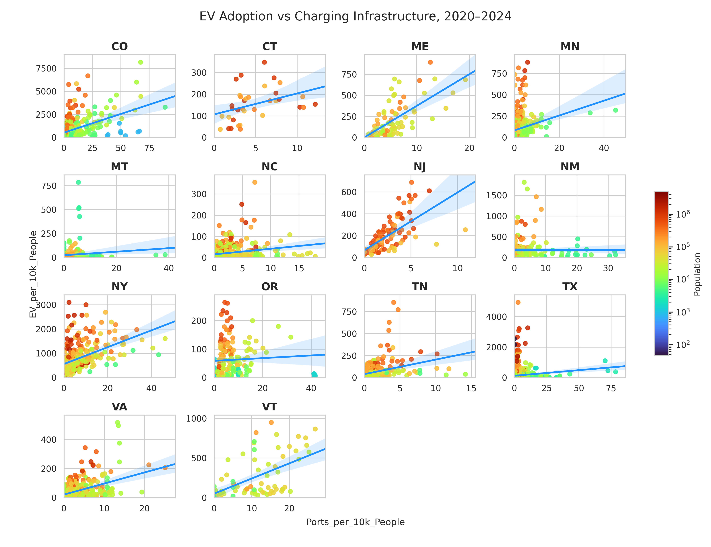
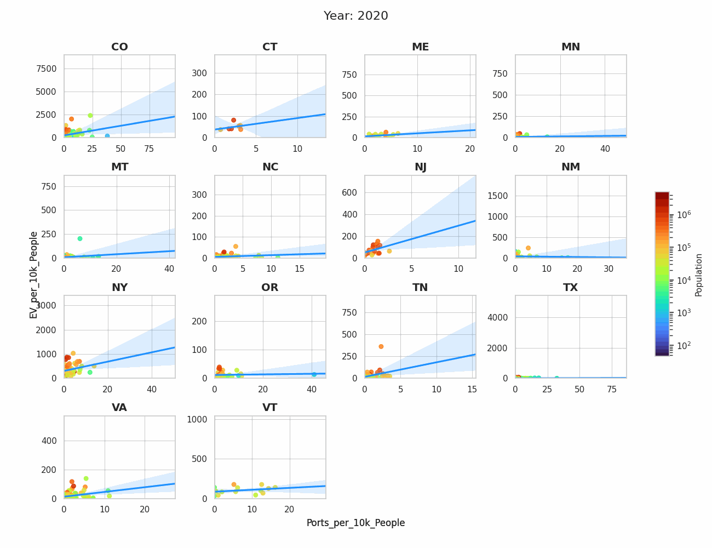

# EV Adoption & Charging Infrastructure Analysis  
Selma Sulejmanovic and Dawn Harris 

---

##  Overview

Our project builds a **data pipeline** to evaluate the relationship between:

- Electric Vehicle (EV) adoption  
- Charging infrastructure availability  

Our pipeline attempts to process raw datasets, clean and merge them, to then apply to **Random Forest models** in order to figure out:

- Whether charging infrastructure influences EV adoption  
- Whether EV adoption influences infrastructure expansion  


##  Why This Matters

The shift to EVs is essential in transitioning to a cleaner transporation system. By cutting carbon emissions, the United States can establish, and move toward, a more eco-friendly and sustainable system.

> **Does charging infrastructure drive EV adoption, or does EV demand drive infrastructure growth?**

Obtaining insight on the correlation between the two helps policymakers and companies to data-driven investments and allocate funds toward environmentally friendly descisions. 

---

##  Project Structure

```
ev_sd/
├── data/
│   ├── raw/        # Original downloaded datasets
│   ├── cleaned/    # Cleaned intermediate files
│   └── final/      # Final datasets for analysis
│
├── scripts/
│   ├── 01_download_datasets.py
│   ├── 02_data_cleaning.py
│   ├── 03_aggregate_ev_by_county.py
│   ├── 04_merge_ev_states.py
│   ├── 05_county_population_cleaning.py
│   ├── 06_reshape_population_by_year.py
│   ├── 07_clean_charging_stations.py
│   ├── 08_count_charging_stations_by_county.py
│   ├── 09_aggregate_charging_by_county_year.py
│   ├── 10_merge_all_data.py
│   ├── 11_fill_missing_county_years.py
│   ├── 12_create_growth_features.py
│   ├── 13_run_random_forest.py
│   └── 14_visualize_animation.py
│
├── images/
│   ├── EV_static_all_years.png
│   └── EV_animation.gif
│
├── pipeline.slurm     # Runs entire pipeline end-to-end
├── .gitignore
└── README.md

```
---

##  Data Sources

### 1. EV Registration Data
- Link: https://www.atlasevhub.com/market-data/state-ev-registration-data/#data
- Date accessed: 03-31-26
- State-level EV registration CSV files  
- Includes:
  - ZIP codes  
  - vehicle counts  
  - registration dates  

---

### 2. Charging Station Data
- Link: https://afdc.energy.gov/data_download
- Filters Used:
  - Dataset → Alternative fuel stations
  - Timeframe → Current
  - Fuel Type → Electric 
  - Station Access → Public
  - Station Status → Open
  - Country → United States
  - State/Province → All
  - File Format → CSV 
- Data accessed: 03-31-26
- Includes:
  - station locations  
  - number of ports
  - type of charger  
  - open dates  

---

### 3. County Population Data
- Link: https://www.census.gov/data/tables/time-series/demo/popest/2020s-counties-total.html
- Date accessed: 04-20-26
- U.S. Census dataset  
- Includes population from **2020–2025** (we used 2020-2024)

---

### 4. ZIP-to-County Crosswalk
- Link: https://www.huduser.gov/portal/datasets/usps_crosswalk.html
- Date accessed: 04-07-26
- Maps **ZIP codes → county FIPS codes**
- Used to convert EV registration data (ZIP-level) into **county-level data**
- When multiple counties are associated with a ZIP, the mapping uses the **highest population ratio (TOT_RATIO)**

---

### 5. County Lookup Table
- Manually created
- Maps **county FIPS codes → county names**
- Ensures consistent county naming across datasets
- Critical for merging EV, charging, and population data

---

## Pipeline Description

### 1. Data Acquisition (`01_download_datasets.py`)
- Downloads all required datasets:
  - EV registration data  
  - Charging station data  
  - County population data  
  - ZIP–county crosswalk  
  - County lookup table  

---

### 2. EV Data Cleaning (`02_data_cleaning.py`)
- Cleans EV registration datasets  
- Standardizes:
  - ZIP codes  
  - county codes  
  - state abbreviations  
  - Maps **ZIP → county FIPS → county name** using:
  - crosswalk table  
  - lookup table  

---

### 3. EV Aggregation (`03_aggregate_ev_by_county.py`)
- Converts registration dates → year  
- Aggregates EV counts by:
  - State  
  - County  
  - Year  

---

### 4. Merge EV Data Across States (`04_merge_ev_states.py`)
- Combines all state-level EV datasets into one dataset  
- Final output:
  - State  
  - County  
  - Year  
  - EV_Count  

---

### 5. Population Cleaning (`05_county_population_cleaning.py`)
- Extracts county and state information  
- Converts population values to numeric  
- Filters to selected states  

---

### 6. Population Reshaping (`06_reshape_population_by_year.py`)
- Converts population data from **wide → long format**

   - Example: 2020, 2021, 2022 → Year column

   - Output: State | County | Year | Population

---

### 7. Charging Data Cleaning (`07_clean_charging_stations.py`)
- Cleans charging station dataset  
- Maps ZIP codes to counties  
- Extracts:
  - State  
  - County  
  - Open date → Year  

---

### 8. Charging Aggregation (`08_count_charging_stations_by_county.py`)
- Aggregates charging data by:
  - State  
  - County  
- Computes:
  - total stations  
  - total ports  

---

### 9. Charging Time Aggregation (`09_aggregate_charging_by_county_year.py`)
- Expands charging data across years (2020–2024)  
- Tracks cumulative infrastructure growth  

Computes:
- Charging_Station_Sites  
- Charging_Ports  
- DC_Fast_Ports  
- Level2_Ports  

---

### 10. Merge All Data (`10_merge_all_data.py`)
Merges:
- EV data  
- Population data  
- Charging data  

Creates key metrics:
- EV_per_10k_People  
- Stations_per_10k_People  
- Ports_per_10k_People  
- EV_per_Station  
- EV_per_Port  

---

### 11. Complete Panel Data (`11_fill_missing_county_years.py`)
- Ensures every county has data for **2020–2024**

Missing values handled as:
- EV = 0  
- Charging = 0  
- Population = forward-filled  

---

### 12. Feature Engineering (`12_create_growth_features.py`)
Creates time-based modeling features:

**Growth variables:**
- EV_per_10k_Growth  
- Stations_per_10k_Growth  

**Lag variables:**
- EV_per_10k_Lag1  
- Stations_per_10k_Lag1  

--

## Dataset Columns

Each row represents a **county-year observation (2020–2024)**.

- **State** – Two-letter state abbreviation  
- **County** – County name
- **Year** – Year of observation  

- **EV_Count** – Total number of registered electric vehicles in the county  
- **Population** – Total county population for that year  

- **Charging_Station_Sites** – Number of charging station locations in the county  
- **Charging_Ports** – Total number of charging ports (all types)  
- **DC_Fast_Ports** – Number of fast chargers 
- **Level2_Ports** – Number of slow chargers

- **EV_per_Station** – Average number of EVs per charging station site  
- **EV_per_Port** – Average number of EVs per charging port  

- **Stations_per_10k_People** – Charging stations per 10,000 people  
- **Ports_per_10k_People** – Charging ports per 10,000 people  
- **EV_per_10k_People** – EV adoption per 10,000 people  

- **EV_per_10k_Growth** – Year-over-year change in EV adoption per 10,000 people  
- **Stations_per_10k_Growth** – Year-over-year change in stations per 10,000 people  

- **EV_per_10k_Lag1** – Previous year’s EV adoption per 10,000 people  
- **Stations_per_10k_Lag1** – Previous year’s stations per 10,000 people 

### 13. Modeling (`13_run_random_forest.py`)

Two Random Forest models are built:

#### Model 1: Infrastructure → EV Growth
> Does charging availability drive EV adoption?

#### Model 2: EV Adoption → Infrastructure Growth
> Does EV demand drive infrastructure expansion?

---

##  Model Results

### Model 1: Infrastructure → EV Growth
- **R² = 0.372 (moderate predictive power)**  

#### Feature Importance:
- **EV_per_10k_Lag1: 0.768 (dominant predictor)**
- **Stations_per_10k_Lag1: 0.181 (secondary influence)**
- **Year: 0.051 (minimal effect)**  

#### Interpretation:
- EV growth is **mostly driven by existing EV adoption**, indicating strong momentum in adoption trends  
- Charging infrastructure does have an effect, but it is **significantly smaller than existing demand**  
- This suggests that while infrastructure supports adoption, it is **not the primary driver**

---

### Model 2: EV Adoption → Infrastructure Growth
- **R² = -0.156 (poor / no predictive power)**  

#### Feature Importance:
- **EV_per_10k_Lag1: 0.528**
- **Stations_per_10k_Lag1: 0.352**
- **Year: 0.121**  

#### Interpretation:
- Although EV adoption appears to have moderate importance, the **model performs worse than a simple baseline**, meaning it does not explain infrastructure growth effectively  
- This indicates that infrastructure expansion is **not strongly driven by EV demand alone**  
- Infrastructure growth could probably be influenced by:
  - government policy  
  - funding and incentives  

---

### 14. Visualization (`14_visualize_animation.py`)
- Creates two visualizations:
  - Animated scatterplot (2020–2024)
  - Static scatterplot (all years combined)

- Key variables:
  - **EV_per_10k_People (demand)**
  - **Ports_per_10k_People (supply)**

---

### `pipeline.slurm`
- SLURM Job
  - SBATCH
  - Load environment
- Runs all scripts
  - Downloads all datasets
  - Cleans and merges 
  - Creates final datasets
  - Runs models and creates visualizations

## Visualizations (Using Professor R Code)

### EV Demand vs Charging Supply (All Years)


### EV Demand vs Charging Supply Over Time (Animation)


## What the Visualization Shows

- Each point represents a **county**
- X-axis: **EV adoption per 10k people (demand)**
- Y-axis: **charging ports per 10k people (supply)**
- Color: **population size**

### Key Interpretation:
This visualization compares **demand (EV adoption)** with **supply (charging infrastructure)** across counties.

### Key Patterns:
- A **positive relationship** suggests infrastructure tends to grow with EV adoption
- Some counties show **high demand but low supply**, indicating potential infrastructure gaps
- Larger counties (warmer colors) tend to have both higher EV adoption and more infrastructure
- The relationship varies significantly across states, suggesting uneven development

---

##  Key Insight (from model + visualizations)

- **EV adoption (demand) and charging infrastructure (supply) are positively related**, but not perfectly aligned  
- Some counties show **high EV adoption with relatively low infrastructure**, indicating potential supply gaps  
- Larger, more populated counties tend to have both:
- higher EV adoption  
- more developed charging networks  
- The relationship between EVs and infrastructure varies significantly by state, suggesting **uneven regional development**  
- Infrastructure expansion is **not purely demand-driven**, implying the importance of:
- policy decisions  
- funding programs  
- long-term planning  

---

## How to Run

### Requirements
Make sure your environment has Python 3 installed.
Versions needed:
- python 3.12.7 
- pandas 2.3.3
- gdown 5.2.2
- scikit-learn 1.6.1
- matplotlib 3.9.4
- seaborn 0.13.2
- pillow 11.3.0
- requests 2.25.1

Install required packages/create environment and run SLURM job:

```bash
module load miniforge3
conda create -n ev_env python=3.9
conda activate ev_env
pip install pandas gdown scikit-learn seaborn matplotlib pillow requests

sbatch pipeline.slurm
```

### Reflection

## (Some) Large Obstacles We Encountered

### Data Acquisition & Formatting
- Some datasets were initially downloaded as **HTML instead of CSV** 

---

### ZIP Code & Identifier Integrity
- Converting files to CSV caused **leading zeros in ZIP codes to be dropped** (e.g., `01234 → 1234`)  
- This broke joins with the crosswalk dataset  
- Required explicitly reformatting ZIP codes to ensure they were always **5 digits (zero-padded)**  
- Similarly, county FIPS codes had to be standardized to **fixed-length formats** to ensure consistent mapping 

---

### Geographic Data Integration
- EV data was provided at the **ZIP-code level**, while other datasets were at the **county level**  
- Required building a multi-step mapping:
  - ZIP → county FIPS (crosswalk)
  - FIPS → county name (lookup table) 
- Some ZIP codes map to multiple counties, requiring the use of **population-based weighting (TOT_RATIO)**  
- In mulitple instances, we came across old FIPs codes, and had to thus create our own look-up table.

---

### Inconsistent County Definitions
- **Connecticut replaced counties with planning regions**, creating inconsistencies with historical datasets  
- **Virginia includes independent cities**, which behave like counties but are labeled differently  
- County naming conventions varied across datasets (e.g., “COUNTY”, “CITY”, formatting differences)  

---

### Data Cleaning & Missing Information
- The population dataset initially had **missing/unclear column headers**  
- Missing county-year combinations required building  
- In counties with lower populations, no EV counts were registered, and thus the year was left out; required a script to still include years with no EV counts and just list it with '0' 

---

### Time-Based Construction
- Charging station data is event-based (open dates), not yearly  
- Required converting into a **cumulative yearly dataset** to match EV trends  

---


